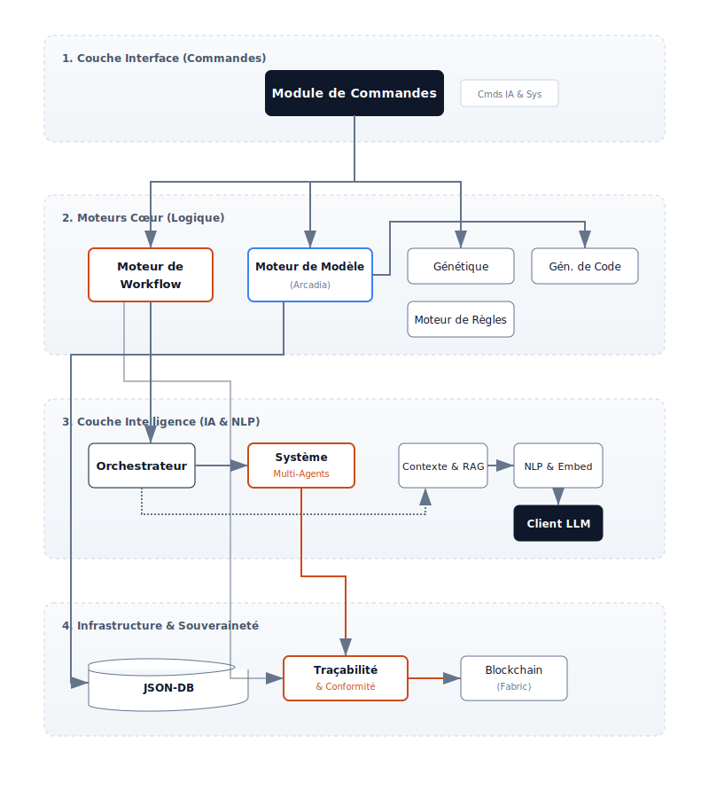
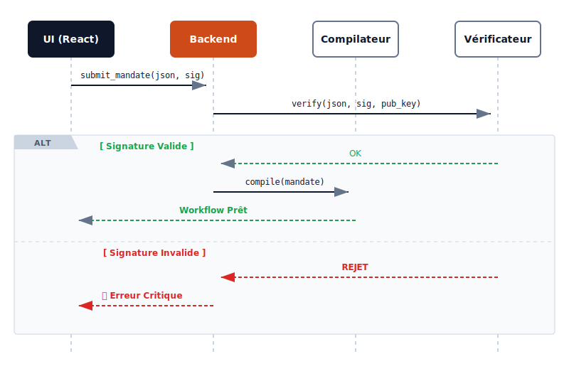

Ce document décrit l'architecture de haut niveau de la plateforme **RAISE** (Reliable AI for Sovereign Engineering). Il détaille comment le système comble le fossé entre l'IA probabiliste et les contraintes d'ingénierie déterministes grâce à une approche **Neuro-Symbolique**.

## 1. Le Paradigme Cœur : Gouvernance Neuro-Symbolique

RAISE fonctionne sur le principe que l'IA (Neuro) doit être le "Pilote" tandis qu'un moteur déterministe (Symbolique) agit comme le "Contrôleur Aérien".

- **La Couche Neuro** : Gérée par le module `ai`. Elle utilise des LLMs (locaux ou distants) pour le raisonnement, la planification et le consensus multi-agents.
- **La Couche Symbolique** : Appliquée par le `workflow_engine` et le `rules_engine`. Elle garantit la sécurité via des **Mandats**, des Vétos codés en dur et des règles algébriques.

---

## 2. Architecture Modulaire Globale

Le diagramme suivant illustre l'organisation structurelle du backend RAISE :



---

## 3. Vue en Couches (High-Level)

Le système est organisé en quatre couches distinctes pour assurer la souveraineté et la modularité :

| Couche                   | Responsabilité                                           | Technologie                   |
| ------------------------ | -------------------------------------------------------- | ----------------------------- |
| **Présentation**         | Console de Gouvernance, visualisation Jumeau Numérique.  | React 18, TypeScript, Zustand |
| **Adaptation**           | Pont IPC, Routage des commandes, Gestion d'état.         | Tauri v2 (Commandes Rust)     |
| **Logique (Le Moteur)**  | Ordonnancement Workflow, Compilation des Mandats, Vétos. | Rust, Tokio (Async)           |
| **Physique (Le Jumeau)** | Interaction Matériel, Simulation Capteurs, Outils MCP.   | Native MCP (Rust), JSON-DB    |

---

## 4. Confiance Cryptographique : Signature des Mandats

La sécurité dans RAISE est un **contrat signé**. Avant qu'un Mandat (la politique définissant les Vétos) ne soit compilé dans un workflow, son intégrité est vérifiée via des signatures **Ed25519**.



---

## 5. Ancrage : Jumeau Numérique & RAG

Pour prévenir les hallucinations, RAISE utilise deux formes d'"Ancrage" (Grounding) :

### 5.1. Le Jumeau Numérique (Ancrage Physique)

Le `model_engine` et les outils du workflow maintiennent une réplique virtuelle temps-réel du système.

- **Boucle de Véto** : Les nœuds `GatePolicy` comparent les propositions de l'IA aux données temps-réel du Jumeau.

### 5.2. RAG & Mémoire (Ancrage Cognitif)

Situé dans `ai/context` et `ai/memory`, le **RAG (Retrieval Augmented Generation)** assure que l'IA a accès à la documentation technique souveraine.

- **Vector Stores** : Support pour `Qdrant` et `LanceDB`.
- **Embeddings** : Traitement local via `candle` ou `fast-embeddings`.

---

## 6. Blockchain & Traçabilité

Pour l'ingénierie critique, chaque changement d'état et chaque mandat doit être auditable.

- **Logs Immuables** : Le module `traceability` enregistre chaque trace de "réflexion" de l'IA et chaque décision de Véto.
- **Ancrage** : Le module `blockchain/fabric` ancre ces traces dans un registre Hyperledger Fabric.
- **Transport Sécurisé** : La connectivité est gérée par le module `blockchain/vpn` (**Innernet**) pour maintenir un maillage privé et décentralisé.

---

## 7. Génération de Code & Optimisation

- **Codegen** : Le module `code_generator` utilise des templates Handlebars/Jinja pour transpiler les modèles Arcadia en **Rust**, **C++**, **VHDL** ou **Verilog**.
- **Génétique** : Le module `genetics` exécute des algorithmes évolutionnaires pour optimiser les architectures système selon des contraintes multi-objectifs (Poids, Coût, Sécurité).

---

## 8. Souveraineté des Données & Offline-First

RAISE est conçu pour être **Souverain par Défaut** :

- **État Local** : L'état de l'application (Zustand) et les données projet (JSON-DB) sont stockés sur la machine de l'utilisateur.
- **Exécution Locale** : Les outils MCP natifs tournent en binaires Rust compilés, garantissant qu'aucune télémétrie n'est envoyée vers des clouds tiers sans configuration explicite.
- **Isolation Réseau** : Le système est compatible avec les VPNs Mesh (Innernet) pour une collaboration sécurisée sans serveur central.

---

## 9. Auditabilité Système (XAI)

Chaque décision prise par le système est enregistrée dans une **Matrice de Traçabilité** contenant :

1. **Le Prompt** : Ce qui a été demandé à l'IA.
2. **Le Contexte** : L'état du Jumeau Numérique à cet instant précis.
3. **Le Raisonnement** : La logique interne de l'IA (processus de pensée).
4. **La Décision de Véto** : Pourquoi le moteur symbolique a autorisé ou bloqué l'action.

```

```
