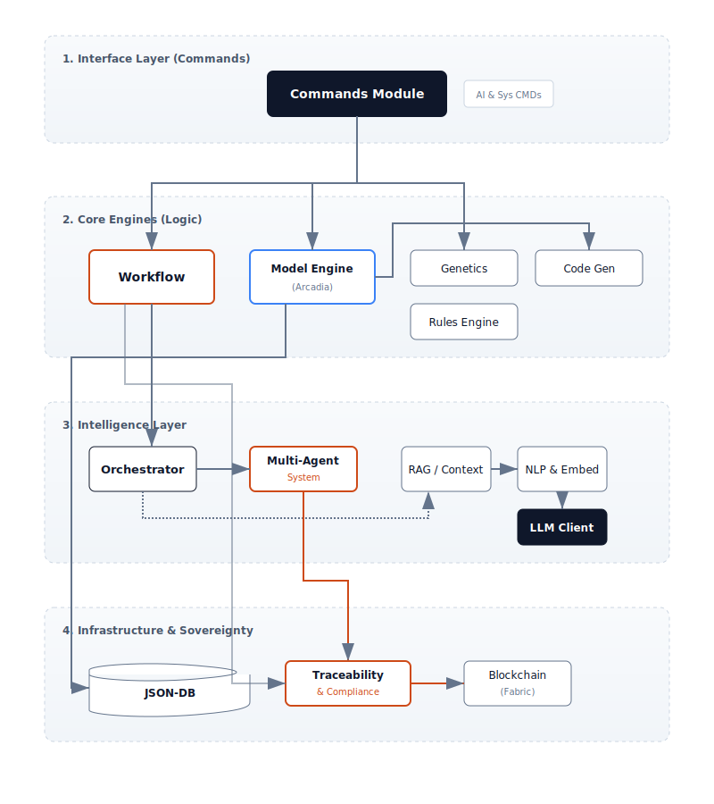

**R.A.I.S.E.** (Rationalized Advanced Intelligence System Engine) est un moteur conçu pour combler le fossé entre l'IA probabiliste et les contraintes d'ingénierie déterministes.

Il ne s'agit pas simplement d'un autre framework d'agent IA, mais d'une infrastructure complète garantissant la **Souveraineté** et la **Sécurité**.

## Philosophie du Moteur

Nous partons du principe que l'IA (Neuro) doit être le "Pilote" tandis qu'un moteur déterministe (Symbolique) agit comme le "Contrôleur Aérien".

- **La Couche Neuro :** Gérée par le module `ai`. Elle utilise des LLMs pour le raisonnement, la planification et le consensus multi-agents.
- **La Couche Symbolique :** Appliquée par le `workflow_engine`. Elle garantit la sécurité via des **Mandats**, des vétos codés en dur et des règles algébriques.

Le diagramme suivant illustre l'organisation structurelle du backend RAISE :



## Installation Rapide

R.A.I.S.E. est construit en **Rust** pour la performance, la sécurité mémoire et l'efficacité énergétique.

### Prérequis techniques

- **Rust** (Dernière version stable)
- **Node.js & pnpm** (Pour l'interface utilisateur Tauri)

* **Une gestion des LLM (GGUF) en local en Rust Natif.** En option, pour les données publiques, une clé API (Google, OpenAI, Anthropic, etc.)

### Démarrage

```bash
# 1. Cloner le dépôt
git clone [https://github.com/Condorcet-Continuum/raise.git](https://github.com/Condorcet-Continuum/raise.git)
cd raise

# 2. Installer les dépendances
pnpm install

# 3. Lancer en mode développement
pnpm tauri dev
```
